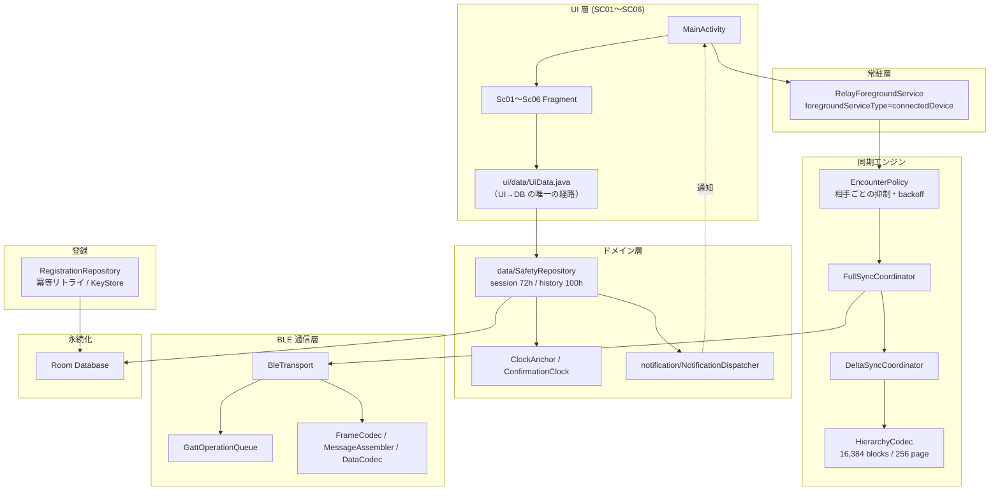

# CrossPath

> ## 基地局が死んだ世界で、**人の移動**を通信網にする。
> 携帯網が繋がらない災害時に、Bluetooth Low Energy の「すれ違い」だけで生存情報をバケツリレーする Android アプリ。

-3DDC84?logo=android&logoColor=white)


---

## 🎤 30秒でわかる CrossPath（審査員の皆さまへ）

| | |
|---|---|
| **課題** | 大規模災害では基地局自体が被災し、安否確認サービスは「通信できること」を前提にしているため機能しない |
| **発想** | 通信できない前提に立ち、**被災者の移動そのものを伝送路**として使う（DTN / バケツリレー） |
| **誰が助かるか** | 直接会ったことのない相手の安否情報が、第三者を経由して届く（マルチホップ中継） |
| **技術的核心** | 生存情報は **1人4バイト**。26万人分の分布を **73バイト**で要約し、**差分だけ**を交換する独自プロトコル |
| **証拠** | ユニットテスト **165件 全て成功**（22クラス）／実機2台での同期収束を **実測ログで確認済み** |
| **誠実さ** | 未実装（暗号署名・本人性検証・3台同時中継）は本書末尾で**明示**しています |

> 📌 現在はハッカソン向け試作。詳細設計書 v0.8（全 11 章）に沿って、BLE 通信・階層同期・中継サービス・個人ID採番まで**実機で動作する状態**です。

---

## 目次

- [なぜ画期的なのか — 5つの設計上の主張](#なぜ画期的なのか--5つの設計上の主張)
- [技術的な工夫（実装の深さ）](#技術的な工夫実装の深さ)
- [プロトコル仕様](#プロトコル仕様)
- [アーキテクチャ](#アーキテクチャ)
- [個人ID採番サーバー](#個人id採番サーバー)
- [画面構成](#画面構成)
- [実測エビデンス](#実測エビデンス)
- [3分で再現するデモ手順](#3分で再現するデモ手順)
- [実装済み / 未実装（正直な線引き）](#実装済み--未実装正直な線引き)
- [ビルドとテスト](#ビルドとテスト)
- [ディレクトリ構成](#ディレクトリ構成)

---

## なぜ画期的なのか — 5つの設計上の主張

### ① 「通信できる」前提を捨てた

既存の安否確認は *本人が能動的に発信できる環境* を仮定します。CrossPath は**通信網が落ちている状態を初期条件**に置き、近くを通った端末同士が情報を預かり合って次へ運ぶ設計にしました。
発信者と受信者は**同時に同じ場所にいる必要がありません**。A→B、B→C と 2 回のすれ違いで、C には A の情報が届きます。
→ 実体は **感染症モデルではなく郵便（store-and-forward）** です。

### ② 生存情報は 1 人 **4 バイト**

運ぶのは「誰が（24bit ID）」と「どの市町村にいるか（8bit 通信コード）」の**合計 4 バイトのみ**。氏名も時刻も位置座標も載せません。

- ID は `1 〜 16,777,215`（24bit、0 は予約）— `data/WireRecord.java`
- 市町村は九州7県の自治体マスタ **233件**（通信コード 1–233、0 と 234–255 は未割当として拒否）— `data/KyushuMunicipalities.java`, `resources/municipalities/`
  - **出典は政府統計 e-Stat**（2026-09-26 取得、九州7県の全市町村）。取得・検証手順と採番規則を `resources/municipalities/README.md` に完全記録し、**公式コードの下位バイトを流用しない独自採番**で将来の再編にも一意性を保証
- データ量を削ることは、**すれ違い時間が短い現場でより多くの人を救う**ことに直結します

**MTU 517 のとき 1 フレームで約 125 人分**（本文 502 バイト ÷ 4）。1 回のすれ違いで数千〜数万人分を運べる計算です。

### ③ 階層型ダイジェスト同期 — **26万人分の分布を 73 バイトで要約**

2 台が出会ったとき、いきなり全件は送りません。まず**要約（ダイジェスト）だけ**を突き合わせ、差分があるブロックだけをピンポイントで取りに行きます。

- ID 空間を **16,384 ブロック × 1,024 ID** に分割（= 2²⁴ を過不足なく被覆。ブロック0のみ 1,023 で ID=0 を予約）
- 1 ページ = **256 ブロック**。各ブロックを **2bit の状態（空 / 満杯 / 部分）** で符号化
  → ヘッダ 9B + 状態 64B = **73 バイトで 262,144 人分の分布**を表現。部分的なブロックのみ個別値を追加
  → 圧縮が得かどうかを**符号化時に自動判定**して生の 2 バイト配列と切り替えます（`protocol/HierarchyCodec.java`）
- さらに **ID 集合の完全一致**は SHA-256（ドメイン分離 `crosspath/id-set/v1\0`）で判定し、**全 ID を送らずに「もう互いに不足なし」を確定**できます

### ④ 72時間で消える。履歴だけ 100時間残る

- 市町村を確定した瞬間から **72時間**が始まり、その期間だけ発信・中継・保存を行います（`SESSION_MS` = 72h）
- 期間終了で**通信データは自動削除**。延長はできず、生存登録をやり直すと次の 72 時間が始まります
  → 「**今生きている**」という情報であり続けるための強制的な鮮度設計です
- 一方で「いつ誰の安否情報を受け取ったか」の通知履歴だけは **100時間**保持（`HISTORY_MS` = 100h）
  → すれ違いが数日途切れる環境でも、後から確認できる余地を残します

### ⑤ 位置情報権限を **1 つも要求しない**

```xml
<uses-permission android:name="android.permission.BLUETOOTH_SCAN"
    android:usesPermissionFlags="neverForLocation" />
```

BLE スキャンは Android では位置情報と結びつきがちですが、CrossPath は **`neverForLocation` を明示**し、位置権限・GPS を一切使いません（`AndroidManifest.xml`）。得られるのは「同じ市町村にいる」という粗い情報だけです。
さらに個人IDは端末の乱数ではなく**サーバー採番**で、secret は **AndroidKeyStore の AES-GCM** で暗号化保存します（`registration/PrefsRegistrationStore.java`）。

### ⑥ 迷ったら「上書きしない」

同じ ID について後から別の地点の情報が届いても、**上書きしません**（first-write-wins）。
どちらが正しいかを判定する手段がない被災地では、アルゴリズムで正解を推定するより**単純で壊れない規則**のほうが強い、という判断です。重複排除は ID 単位で行い、中継しても情報は増殖しません。

---

## 技術的な工夫（実装の深さ）

「すれ違い」は**数十秒しかない、途切れる、相手が誰か分からない**という極端に厳しい伝送路です。ここに合わせた実装上の工夫：

| 厳しい現実 | 工夫 | 実装 |
|---|---|---|
| 45秒で去っていく | **接触 1 回 = 65,536 バイトの送信予算**を 50/50 で配分し、片方向が終われば**余りを相手方向へ譲渡**（`sendLimit = peerEnded ? byteBudget - rxBytes : byteBudget / 2`）。既定値 65,536B / 45,000ms は中継サービスが注入 | `sync/DeltaSyncCoordinator.java`, `service/RelayForegroundService.java` |
| いつ切れても壊れない | 予算は**送信前に予約**し、超過する送信はその場で `PARTIAL` として打ち切る。切れても会計が破綻しない | `sync/DeltaSyncCoordinator.java` |
| 毎回同じ相手に会う | 相手ごとに抑制：成功 60秒 / 失敗は **5→10→20→40…最大300秒 ±20% ジッター**、最大 256 相手を保持。自分の情報が増えたら抑制を**最短5秒に短縮** | `sync/EncounterPolicy.java` |
| 相手の実装が違うかもしれない | ハンドシェイクで**能力交渉**（FULL/FLAT/HIERARCHICAL）。相手が FLAT しか対応しなければ**自動フォールバック** | `protocol/Protocol.java` |
| BLE は同時実行に弱い | GATT 操作を**直列化キュー**で並べ、タイムアウトを一元管理（操作 10秒 / 接続 45秒） | `ble/GattOperationQueue.java` |
| MTU が端末で違う | MTU 実交渉値（23〜517）から**1 フレームの本文長を動的に算出**：`min(MTU-3, 512) - 10` | `protocol/Protocol.java` |
| 切断で壊れたデータ | 全本文に **CRC32** を付け、検証を通らないメッセージは破棄 | `protocol/FrameCodec.java` |
| 時計が狂う／再起動 | 壁時計に加え**単調時計とアンカー**で期限を再評価（巻き戻し・再起動を考慮） | `data/ClockAnchor.java`, `data/ConfirmationClock.java` |
| 「速くなった気がする」を排除 | 画面に **ATT 換算 TX/RX・有効レコード率・ATT 効率**を表示。無線再送や暗号化を含む電波上の総量とは**区別して明記** | `BleDebugActivity.java`, `docs/CHAPTER10_SYNC.md` |

> つまり CrossPath は「BLE で送るだけ」ではなく、**帯域予算・輻輳制御・能力交渉・時計異常・計測**まで作り込んだ、独自の DTN（Delay/Disruption Tolerant Networking）実装です。

---

## プロトコル仕様

互換性のため独立実装と合意できるよう、プロファイルをコード上の定数として固定しています（`protocol/Protocol.java`：`MAJOR=4, MINOR=0`）。

| 項目 | 値 |
|---|---|
| サービス UUID | `9c2f0001-7c0b-4a1e-9b6d-0ce341a42160` |
| RX / TX 特性 UUID | `9c2f0002-…` / `9c2f0003-…` |
| ヘッダ長 | **10 バイト**（type 1B / flags 1B / msgId 2B / fragIndex 2B / fragCount 2B / bodyLen 2B） |
| 本文長 | 最大 4096 バイト（末尾 4 バイトは CRC32） |
| フレーム本文 | `min(MTU-3, 512) - 10` バイト |
| メッセージ型 | HELLO / BEGIN / SUMMARY / REQUEST / DATA / ACK / TURN_END / DONE / L1_PAGE / L2_REQUEST / L2_RESPONSE / ID_LIST |
| 大メッセージ | フラグメント分割 → `fragIndex / fragCount` で再構成（`protocol/MessageAssembler.java`） |

```
 0        1        2      4      6      8      10                        n
+--------+--------+------+------+------+------+--------------------------+
|  type  | flags  | msgId|fragIx|fragCt|bodyLn|  body の断片             |
|   1B   |   1B   |  2B  |  2B  |  2B  |  2B  |（最終断片は 4B CRC32 で終端）|
+--------+--------+------+------+------+------+--------------------------+
|<---------- 10 バイトの固定ヘッダ --------->|<- 最大 502B (MTU 517) ->|

bodyLen = メッセージ本文全体の長さ（末尾の CRC32 を含む）
```

`TURN_END`（未完了フラグ付き）による**明示的なターン制御＝交互転送**を入れており、片方が話し続けて予算を食い潰すことを防ぎます。

---

## アーキテクチャ

責務を層で分離し、**通信担当との分業境界をインターフェースとして固定**しています。



---

## 個人ID採番サーバー

他人の ID と衝突しない 24bit ID を、**端末の乱数ではなくサーバーが採番**します。

- 公開エンドポイント: `POST /v1/registrations` / `GET /v1/registrations/me`
  `https://id-server-1084526017972.asia-northeast1.run.app`（Google Cloud Run, `asia-northeast1`）
- **43 文字の base64url secret（32 バイト乱数）** を発行し、端末は **AndroidKeyStore の AES/GCM/NoPadding**（128bit タグ・12 バイト IV）で暗号化して保存（`registration/RegistrationSecret.java`, `PrefsRegistrationStore.java`）
- **ネットワークが不安定でも二重登録しない**：
  - 通信前に `request_id`(UUID v4) を保存 → リトライで**同じ値を使い回し冪等性を担保**
  - `409` は `GET /v1/registrations/me` で復旧
  - `429 / 408 / 5xx` は **指数バックオフ＋±20% ジッター、最大 4 回追加試行**（`registration/RegistrationRetryPolicy.java`）
  - 再試行不能コード（`ID_SPACE_EXHAUSTED` 等）は即時失敗させ、無駄打ちしない
- **接続タイムアウト 5 秒 / 読み取り 10 秒**、secret はログ・例外・URL に絶対に載せない

---

## 画面構成

設計書 v0.8 第 11 章に基づく 6 画面。下部タブバーは SC02 / SC04 / SC05 / SC06 で共通、登録フロー（SC01・SC03）では非表示です。

| ID | 画面 | 役割 |
|---|---|---|
| SC01 | 初回登録 | 名前を入力し、サーバーから個人IDを取得 |
| SC02 | ホーム | 状態表示・生存登録の起点 |
| SC03 | 市町村選択 | 九州7県 233 自治体から現在地を選択 |
| SC04 | 緊急時画面 | 72時間タイマー、探索・接続・同期の進行状況を可視化 |
| SC05 | 通知対象者管理 | 安否を知りたい人を登録 |
| SC06 | 通知履歴 | 誰の安否をいつ受け取ったか（100時間保持） |

72時間タイマー作動中は**全画面とタブバーがダーク表示**に切り替わります（`ui/theme/ScreenThemes.java`）。

---

## 実測エビデンス

「動きます」ではなく「**測りました**」で示します。

### ユニットテスト

```
22 クラス / 165 テスト / 失敗 0 / エラー 0 / スキップ 0
（app/build/test-results/testDebugUnitTest/*.xml の実測値）
```

通信プロトコル（`ProtocolTest`, `HierarchyCodecTest`, `WireRecordTest`）、同期（`FullSyncCoordinatorTest`, `DeltaSyncCoordinatorTest`, `EncounterPolicyTest`）、登録（`RegistrationRepositoryTest`, `RegistrationRetryPolicyTest`, `ServerRegistrationGatewayTest`）、期限（`SessionExpiryTest`, `MonotonicExpiryTest`, `ClockAnchorTest`）、画面遷移（`ScreenPolicyTest`, `UiJourneyTest`）を含みます。

### 実機 2 台での同期収束（Pixel / Galaxy）

| 条件 | 結果 |
|---|---|
| HIERARCHICAL / MTU 517、片方向に不足 2 件 | 双方 `EXCHANGED` → **再接触で双方 `EQUAL`、DATA 送信 0 件**（無駄な再送なし） |
| FLAT / MTU 23（最小 MTU） | 双方 `EQUAL`、DATA 送信 0 件 |
| 役割（Central/Peripheral）を**逆転** | 双方 `EQUAL`、DATA 送信 0 件 |

### 常駐と計測

- `dumpsys` で `isForeground=true` / `type=0x10`（`connectedDevice`）/ Channel `relay` を確認
- 期限境界（72時間直前・ちょうど）、100時間失効境界、通知後クラッシュからの同一ID再試行、二重確定などを検証
- debug APK 限定で「保存後 ACK を一時停止」する**切断試験スイッチ**を実装し、切断時のデータ保持を検証

詳細な生ログは [`docs/BLE_VERIFICATION.md`](docs/BLE_VERIFICATION.md)、[`docs/CHAPTER10_SYNC.md`](docs/CHAPTER10_SYNC.md)、[`docs/RELAY_SERVICE.md`](docs/RELAY_SERVICE.md)、[`docs/remaining-features.md`](docs/remaining-features.md) にあります。

---

## 3分で再現するデモ手順

**必要なもの**: Android 12 以上の端末 2 台（Bluetooth ON）

```bash
# 1. ビルドして両端末へインストール
export JAVA_HOME="$HOME/.local/opt/android-studio/jbr"
export ANDROID_HOME="$HOME/Android/Sdk"
./gradlew assembleDebug --console=plain
adb -s <端末A> install -r app/build/outputs/apk/debug/app-debug.apk
adb -s <端末B> install -r app/build/outputs/apk/debug/app-debug.apk

# 2. 両端末でアプリを起動し、名前を登録 → 市町村を確定（SC03）
#    → 72時間タイマーが開始し、全画面がダーク表示に切り替わる
#    → 中継サービスが自動起動（常駐通知が出ます）

# 3.（任意）通信の中身を見る場合は検証画面を adb 起動
adb -s <端末A> shell am start -n com.example.crosspath.debug/com.example.crosspath.BleDebugActivity
```

2 台を近づけて SC04（緊急時画面）を見ると、**探索 → 接続 → 同期 → 相手との不足なし** の遷移と、ATT 換算 TX/RX・有効レコード率が表示されます。
デモのクライマックスは **「片方の端末にだけ新規情報を入れて再接触させ、DATA が 0 件で `EQUAL` に収束する」** ところです — 差分同期が効いていることが数字で見えます。

---

## 実装済み / 未実装（正直な線引き）

審査員の皆さまに誤解なく評価いただくため、境界を明示します。

| 機能 | 状態 | 根拠 |
|---|---|---|
| 独自 BLE プロトコル（v4.0）・フラグメント・CRC | ✅ 実装・テスト済み | `protocol/` |
| 階層型ダイジェスト同期 / FLAT フォールバック | ✅ 実装・実機 2 台で収束確認 | `sync/`, `docs/CHAPTER10_SYNC.md` |
| 72時間セッション・100時間履歴・自動削除 | ✅ 実装・テスト済み | `data/SafetyRepository.java` |
| 個人ID採番サーバー連携（冪等・暗号化保存） | ✅ 実装・本番サーバーで E2E 確認 | `registration/` |
| 常駐中継サービス（画面消灯中の継続通信） | ✅ 実装・`dumpsys` 確認 | `service/`, `docs/RELAY_SERVICE.md` |
| Android 通知（対象者の受信時） | ✅ 実装・テスト済み | `notification/` |
| **暗号署名・本人性の検証（なりすまし対策）** | ❌ **未実装**（ID はサーバー採番のため衝突はしないが、第三者が他人の ID を騙る対策は今後） | — |
| **3 台以上でのマルチホップ実証** | ❌ 未実施（2 台では確認済み） | `docs/RELAY_SERVICE.md` |
| **大規模・省電力・機種差（Android 12〜16）の性能評価** | ❌ 未実施 | `docs/RELAY_SERVICE.md` |
| HIERARCHICAL / MTU 23 での 45 秒内完了 | ⚠️ 実測で未完了となる条件あり（制限を維持し未完了として扱う） | `docs/RELAY_SERVICE.md` |

---

## ビルドとテスト

**前提**: Android SDK 37 (compileSdk) / minSdk 31 / JDK（検証環境 JDK 25、ソース互換 Java 11）

```bash
./gradlew testDebugUnitTest assembleDebug lintDebug
# テスト結果: app/build/reports/tests/testDebugUnitTest/index.html
# APK:      app/build/outputs/apk/debug/app-debug.apk
```

実機テスト: `./gradlew connectedDebugAndroidTest`（Pixel で 61 件成功の記録あり）

---

## ディレクトリ構成

```
app/src/main/java/com/example/crosspath/
├── protocol/    # ワイヤプロトコル（Protocol / FrameCodec / DataCodec / HierarchyCodec / MessageAssembler）
├── ble/         # BLE 通信層（BleTransport / GattOperationQueue）
├── sync/        # 同期エンジン（FullSync / DeltaSync / EncounterPolicy）
├── service/     # 常駐中継サービス（RelayForegroundService）
├── data/        # ドメイン・永続化（SafetyRepository / Room / 自治体マスタ / 時計）
├── registration/# 個人ID採番サーバー連携
├── notification/# 通知ディスパッチャ
└── ui/          # SC01〜SC06・テーマ・遷移
```

---

## 開発体制

詳細設計書 v0.8（全 11 章）を基準に、**UI / 通信 / 登録 API を分業**し、境界をインターフェース（`RegistrationGateway`, `SyncStore` 等）として固定して並行開発しています。
仕様書・設計照合・検証記録は [`docs/`](docs/) に、自治体マスタの出典と採番規則は [`resources/municipalities/README.md`](app/src/main/resources/municipalities/README.md) に記載しています。
