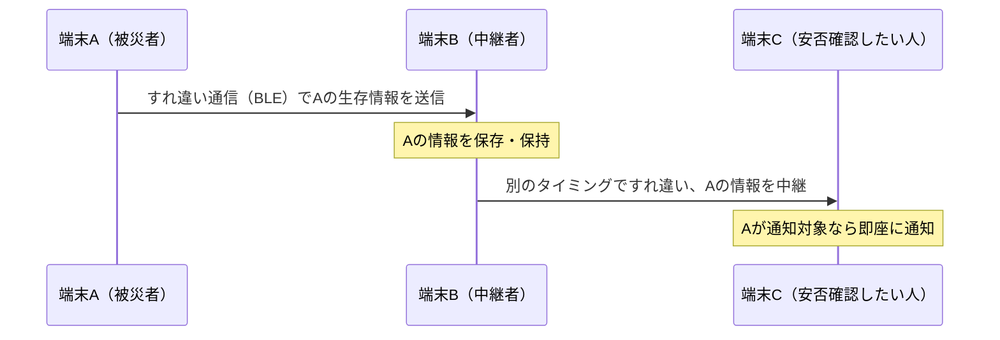
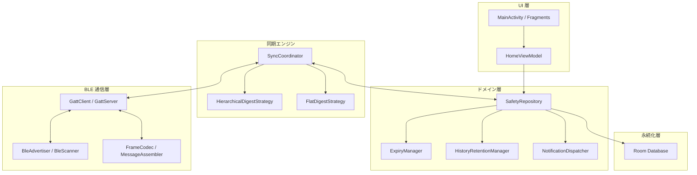

# CrossPath

**通信インフラが途絶した災害時に、人から人へバケツリレーで生存情報を届ける Android アプリ**

大規模災害でモバイル回線が止まっても、人はまだ動いています。CrossPath は Bluetooth Low Energy による**端末同士のすれ違い通信**だけで生存情報を運び、基地局にもインターネットにも頼らずに「誰かが確かに生きている」という情報を、より多くの人へ届けることを目指すプロジェクトです。

> ⚠️ 本リポジトリはハッカソン向けの試作開発中です。本書の内容は詳細設計書（草案 v0.8）に基づく設計方針であり、実装は段階的に進行中です。本人性の検証や暗号署名は現時点では未対応です。

---

## 目次

- [CrossPath とは](#crosspath-とは)
- [解決したい課題](#解決したい課題)
- [主な特徴](#主な特徴)
- [動作イメージ](#動作イメージ)
- [アーキテクチャ](#アーキテクチャ)
- [データ設計のこだわり](#データ設計のこだわり)
- [技術スタック](#技術スタック)
- [画面構成](#画面構成)
- [実装ロードマップ](#実装ロードマップ)
- [開発体制](#開発体制)
- [参考資料](#参考資料)

---

## CrossPath とは

災害発生直後、通信キャリアの回線は輻輳や設備損壊で使えなくなることがあります。そんな状況でも、避難所や道端ですれ違う人のスマートフォン同士は、Bluetooth さえ生きていれば直接つながります。

CrossPath は、その一瞬のすれ違いを使って「自分は生きていて、どこの市町村にいるか」という最小限の情報だけを端末間でバトンのように受け渡していくアプリです。受け取った情報はさらに次にすれ違った人へ中継され、通信網が復旧しなくても、口コミのように少しずつ広がっていきます。

## 解決したい課題

- 災害時は通信インフラそのものが被災し、安否確認サービスが機能しないことがある
- 遠方の家族・友人は、被災地にいる大切な人の安否を知る手段が限られる
- 既存の安否確認は「本人が能動的に発信できる通信環境」を前提にしていることが多い

CrossPath は、**通信できない前提**からスタートし、「人の移動」そのものを通信網として使うことでこの空白を埋めます。

## 主な特徴

### 🪶 極限まで軽い生存情報（4バイト／件）
1件の生存情報は「個人ID（24bit）」と「生存地点（市町村コード）」だけ。登録時刻や氏名などは一切載せません。1件あたりの情報量を切り詰めることで、短いすれ違い時間でもより多くの人の情報を交換できるように設計しています。

### 🔀 階層型ダイジェスト同期
2台の端末が接続すると、まず「どのブロックにどれだけの人数がいるか」という要約（ダイジェスト）だけを比較し、差分があるブロックだけをピンポイントで交換します。全件を毎回送り直すのではなく、**まだ知らない情報だけ**を優先して伝え合う仕組みです。

### ⏱️ 72時間の生存確認ウィンドウ
市町村を確定した時点から72時間、自分の情報の発信・他者の情報の中継・保存を行います。期限が来ると通信用のデータは自動的に削除され、新しく生存登録をやり直すことで次の72時間が始まります。「今生きている」ことを示す情報であり続けるための設計です。

### 📬 通知履歴は100時間保持
72時間の通信期間が終わっても、「いつ誰の安否情報を受け取ったか」という通知履歴だけは100時間残ります。すれ違いが途切れがちな環境でも、後から確認できる余地を残しています。

### 🛡️ 一度保存したら上書きしない
同じ人のIDについて、後から違う地点の情報が届いても上書きしません。どちらが正しいかを判定する手段がない以上、「最初に受け取った情報を素直に中継し続ける」というシンプルで壊れにくいルールを徹底しています。

### 🔗 マルチホップ中継
A→B、B→Cとすれ違いをつなげていくことで、発信者と直接出会っていない人にも情報が届きます。中継のたびに情報が壊れたり増殖したりしないよう、個人IDごとの重複排除を徹底しています。

## 動作イメージ

1. 平常時にアプリを起動し、自分の個人IDを登録しておく
2. 災害発生後、「生存ボタン」を押して自分がいる市町村を選択・確定する
3. 確定と同時に72時間のカウントダウンが始まり、バックグラウンドで自動的にすれ違い通信を開始
4. 近くを通った他の端末と自動的に情報を交換し、自分の生存情報を広めつつ、他者の情報を中継
5. 安否を知りたい人（通知対象者）を登録しておくと、その人の情報を受信した瞬間に通知が届く

## アーキテクチャ

UI・通信制御・同期ロジック・永続化を明確に分離し、通信担当メンバーとの分業境界をインターフェースとして固定しています。

- **UI 層**：XML + Java。画面遷移・入力・表示に専念し、DB や BLE を直接触らない
- **同期エンジン**：BLE の生の API には触れず、`onEncounter` / `sendBlock` / `insertIfAbsent` といった意味付けされたインターフェース越しにのみ動作
- **BLE 通信層**：GATT の接続・断片化・再構成を担当。担当メンバーとの実装分業を前提に境界を設計
- **永続化層**：Room。1件のトランザクションで人物追加・通知履歴・同期用カウンタを一括更新し、整合性を保証

## データ設計のこだわり

| 指標 | 内容 |
|---|---|
| 1件あたりの通信本体サイズ | **4バイト**（個人ID 24bit ＋ 生存地点 8bit） |
| 従来案からの削減率 | 約 **93.75%**（64B → 4B） |
| 同じ容量に格納できる件数 | 従来比 **16倍** |
| 保存上限設計値 | 1,300万人（個人IDは24bit空間で対応） |
| 生存確認の有効期間 | 市町村確定から **72時間** |
| 通知履歴の保持期間 | 通信期間終了から **100時間** |

送受信フレームには通信制御用のヘッダーやCRC・ACKなどが別途必要ですが、「生存情報そのもの」を極限まで軽くすることで、限られたすれ違い時間の中で交換できる人数を最大化する方針を一貫させています。

## 技術スタック

| 分類 | 採用技術 |
|---|---|
| 言語 / OS | Java / Android（最低 API 31 を試作の下限に設定） |
| IDE | Android Studio |
| 端末間通信 | Bluetooth Low Energy（BLE） / GATT |
| ローカル DB | Room（SQLite） |
| UI | XML レイアウト + Java |
| 非同期処理 | `ExecutorService` / `ScheduledExecutorService` |
| バックグラウンド常駐 | Foreground Service |

スレッド設計として、UI操作・通信制御・DB書き込みをそれぞれ専用の Executor に分離し、BLE のコールバックから直接 DB を触らない構成にしています。

## 画面構成

| 画面 | 役割 |
|---|---|
| ホーム | 生存ボタン、自分のID表示・共有、各種メニューへの入口 |
| 市町村選択 | 生存地点として送信する市町村を選択・確定 |
| 緊急時画面 | 72時間のカウントダウンと、通知対象者の受信状況（〇／ー）を表示 |
| 通知対象者管理 | 安否を知りたい相手の個人IDを登録 |
| 通知履歴 | 通知対象者について、今回の通信期間内での受信状況を確認 |

「〇」は今回の通信期間内で受信済みであることを示すシンプルな記号で、現在の安全や現在地を保証するものではない、という前提を画面設計全体で一貫させています。

## 実装ロードマップ

段階を追って機能を積み上げ、各段階で完了条件を確認してから次へ進む方針で開発しています。

- [ ] **Stage 1** — 2台間の BLE 通信基盤（広告・探索・接続・分割送受信）
- [ ] **Stage 2** — Room への保存と個人ID単位の重複排除
- [ ] **Stage 3** — 3台以上でのマルチホップ中継
- [ ] **Stage 4** — 通知対象管理と通知履歴
- [ ] **Stage 5** — 72時間の期限管理と自動削除・再登録
- [ ] **Stage 6** — ID一覧の差分交換による無駄な再送の抑制
- [ ] **Stage 7** — 階層型ダイジェスト同期による大規模データセットへの対応

## 開発体制

本プロジェクトはハッカソンでの短期集中開発として、BLE通信の実装担当と、Room・画面・期限管理・同期ロジックの実装担当とでインターフェースを介した分業を行っています。まずは実機2台（Galaxy / Pixel）間での生存情報交換の成功をデモの第一目標としています。

## 参考資料

- [Bluetooth permissions（Android Developers）](https://developer.android.com/develop/connectivity/bluetooth/bt-permissions)
- [Communicate in the background（Android Developers）](https://developer.android.com/develop/connectivity/bluetooth/ble/background)
- [Transfer BLE data（Android Developers）](https://developer.android.com/develop/connectivity/bluetooth/ble/transfer-ble-data)
- [Room Transaction（Android Developers）](https://developer.android.com/reference/androidx/room/Transaction)

---

  すれ違う一人ひとりが、次のバトンになる。

